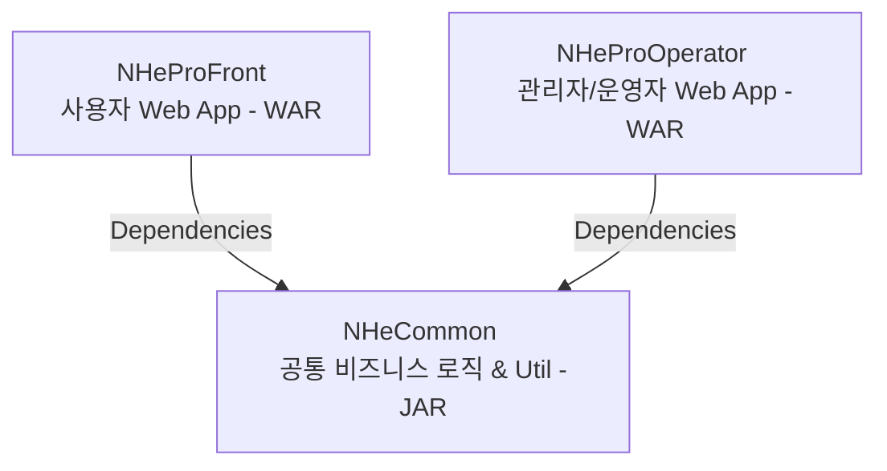

# NHEPRO 프로젝트 개발 가이드 (README)

본 문서는 **NHEPRO** 프로젝트에 새로 참여하게 된 개발자가 프로젝트의 전체적인 구조, 기술 스택, 핵심 설정 및 개발 방식을 빠르게 파악하고 적응할 수 있도록 지원하는 종합 코드베이스 분석서입니다.

---

## 1. 프로젝트 개요 (Overview)
* **시스템명:** NHEPRO (농협 구매/계약 및 공급망 관리 시스템 - EverSRM 기반 고도화)
* **솔루션 기반:** 에스티원즈(ST-Ones)의 구매/계약 솔루션인 **EverSRM** 프레임워크를 기반으로 구축되었습니다.
* **주요 업무 영역:** 
  * 협력사 관리 및 심사
  * 전자계약 (CCTR - 원청계약, SCTR - 하청계약 등)
  * 구매/입찰 관리 및 전자 세금계산서 연동
  * 외부 보안 및 암호화 모듈(MagicLine, Raon secure, Crosscert 등) 연동
  * 실시간 그리드 데이터 처리 (RealGrid, EverUXF UI 라이브러리 활용)

---

## 2. 프로젝트 아키텍처 및 멀티 모듈 구조

NHEPRO 프로젝트는 Apache Maven 기반의 멀티 모듈 형태로 설계되어 있으며, 크게 공통 모듈과 웹 모듈(Front/Operator)로 나뉩니다.



### 각 모듈별 상세 정보
1. **[NHeCommon](file:///c:/ST-onesIDE/workspace/NHEPRO/NHeCommon)** (JAR)
   * **역할:** Front와 Operator 공통으로 사용하는 도메인 객체(Domain/DTO), 데이터 접근 객체(DAO), 비즈니스 서비스 클래스, 공통 유틸리티 모듈이 위치해 있습니다.
   * **종속성:** 프레임워크 코어 라이브러리 및 주요 연동용 JNI 모듈들이 포함되어 있습니다.
2. **[NHeProFront](file:///c:/ST-onesIDE/workspace/NHEPRO/NHeProFront)** (WAR)
   * **역할:** 일반 사용자 및 협력업체 사용자를 위한 웹 프레임워크 영역입니다.
   * **주요 특징:** 화면단 JSP 파일들과 사용자 웹 서비스용 컨트롤러(Controller)가 존재합니다.
3. **[NHeProOperator](file:///c:/ST-onesIDE/workspace/NHEPRO/NHeProOperator)** (WAR)
   * **역할:** 시스템 관리자 및 내부 운영자를 위한 포털 및 백오피스 영역입니다.
   * **주요 특징:** 메뉴 권한, 공통 코드, 로그 수집 등 관리용 기능 컨트롤러가 중심을 이룹니다.

---

## 3. 핵심 기술 스택 (Technology Stack)

프로젝트에 사용된 프레임워크와 주요 기술 사양은 다음과 같습니다.

* **Java/JDK:** **JDK 1.8**
  * *참고: 기존 JDK 1.7 버전에서 컴파일 타깃 및 소스 버전이 JDK 1.8로 상향 고도화되었습니다.*
* **Web WAS:** **JEUS 7** (운영 서버는 향후 **JEUS 8**로 업그레이드 예정)
* **Framework:** **Spring Framework 3.2.18.RELEASE** (Spring MVC 아키텍처)
* **ORM / Persistence:** **MyBatis 3.4.4**
* **Database:** **Oracle Database** (Oracle 12c 계열, `ojdbc7.jar` 사용)
* **UI & Rendering:** JSP (JavaServer Pages) + **EverUXF 1.1** (에스티원즈 UI 프레임워크) + **RealGrid**
* **DWR (Direct Web Remoting):** DWR 3.0.2-RELEASE (Ajax 기반 비동기 통신을 원활히 지원하기 위해 사용)
* **Batch / Scheduler:** **Quartz Scheduler 2.2.1**
* **Build Tool:** **Apache Maven**

---

## 4. 주요 설정 파일 및 디렉터리 경로

신규 개발 시 확인해야 하는 핵심 설정 파일들의 위치입니다.

### ① Spring & Persistence 설정
* **Spring Context 로드 설정:** [web.xml](file:///c:/ST-onesIDE/workspace/NHEPRO/NHeProFront/src/main/webapp/WEB-INF/web.xml)에 정의되어 있으며, `classpath:spring/context-*.xml` 패턴으로 설정을 읽어들입니다.
* **Properties 설정 관리:** [context-properties.xml](file:///c:/ST-onesIDE/workspace/NHEPRO/NHeProFront/src/main/resources/spring/context-properties.xml)에서 설정 파일을 바인딩하며, `everuxf.properties`, `eversrm.properties`, `nhepro.properties` 순으로 읽어들여 `PropertiesManager` 클래스를 통해 활용합니다.
* **데이터베이스 접속 및 MyBatis 설정:**
  * 로컬/개발 DB 정보: [oracle-datasource.xml](file:///c:/ST-onesIDE/workspace/NHEPRO/NHeProFront/src/main/resources/spring/datasources/oracle-datasource.xml)
  * MyBatis Config: [sqlmap-config-oracle.xml](file:///c:/ST-onesIDE/workspace/NHEPRO/NHeProFront/src/main/resources/mybatis/sqlmap-config-oracle.xml)
  * SQL 쿼리 매퍼 위치: `src/main/resources/mappers/com/st_ones/**/*.xml`

### ② WAS 웹 배포 서술자 (WAS Deployment Descriptor)
* [jeus-web-dd.xml (Front)](file:///c:/ST-onesIDE/workspace/NHEPRO/NHeProFront/src/main/webapp/WEB-INF/jeus-web-dd.xml)
  * JEUS 환경 전용 웹 컨텍스트(`/nhepro`) 설정 및 세션 풀링, 오토 로드 방식을 정의합니다.
  * JEUS 8 업그레이드 대비를 위해 스키마 버전이 `8.0`으로 설정되어 있습니다.

### ③ 외부 연동 설정 (Properties)
* [nhepro.properties (Front)](file:///c:/ST-onesIDE/workspace/NHEPRO/NHeProFront/src/main/resources/nhepro.properties)
* [nhepro.properties (Operator)](file:///c:/ST-onesIDE/workspace/NHEPRO/NHeProOperator/src/main/resources/nhepro.properties)
  * UI 그리드 공통 옵션(`gridOption.*`) 및 JEUS WAS 서버 로그 경로(`eversrm.log.path.*`)가 명시되어 있습니다.

---

## 5. 프로젝트 빌드 및 기동 방법

### ① 로컬 환경 빌드 (Maven)
전체 프로젝트 또는 공통 라이브러리(`NHeCommon`)를 빌드하여 로컬 maven repository에 설치한 후 웹 모듈을 패키징해야 합니다.

```bash
# 1. 전체 모듈 청소 및 패키징/설치
mvn clean install

# 2. 특정 웹 모듈(예: Front)만 빌드하려는 경우
cd NHeProFront
mvn clean compile war:war
```

### ② 로컬 및 배포 프로파일 (Profiles)
Maven 빌드 시 프로파일 옵션에 따라 설정 환경이 분기됩니다.
* **local:** 로컬 개발용 DB 및 가상 로그 환경 세팅 (기본 활성화)
* **development:** 개발(계본) 서버 배포 환경
* **production:** 운영 서버 배포 환경

```bash
# 운영 환경 프로파일로 빌드하는 경우
mvn clean install -Pproduction
```

---

## 6. 신규 개발자 필독 가이드 & 주의사항

1. **JDK 1.8 버전 준수**
   IDE(Eclipse, IntelliJ, VS Code)의 JDK 컴파일 수준을 **Java 1.8**로 맞춰주십시오. 1.7 버전 이하로 빌드 시 람다 식이나 기타 신규 API 구문에서 에러가 발생할 수 있습니다.
2. **WAS 로그 뷰어 경로 변경**
   서버 모니터링 메뉴(`WatcherController.java`)의 로그 경로는 각 웹 프로젝트의 `nhepro.properties` 파일 내 `eversrm.log.path.*` 키값에서 참조합니다. JEUS 8 이관이나 기타 서버 경로 이전 시 Java 코드 수정 대신 **프로퍼티 파일의 경로 값만 운영 환경에 맞게 수정**하십시오.
3. **MyBatis XML 매퍼 위치**
   새로운 쿼리를 생성할 때 `mappers/com/st_ones/` 하위 업무 디렉터리 구조를 올바르게 일치시켜주어야 컨텍스트 로딩 시 자동으로 스캔됩니다.
4. **외부 JNI 모듈 로딩 주의**
   `BCAVerifyHelper`, `MagicJCrypto`, `fasoo-jni` 등 연동 모듈들은 WAS 기동 시 OS 환경 변수(`PATH` 또는 `LD_LIBRARY_PATH`)에 Native Library 파일 경로가 지정되어야 정상 구동될 수 있으므로, 서버 환경 구축 시 가이드를 철저히 확인해야 합니다.

---

## 7. 관련 추가 문서 목록
* [docs/운영서버_업그레이드방안.md](file:///c:/ST-onesIDE/workspace/NHEPRO/docs/운영서버_업그레이드방안.md): JEUS 7 ➔ JEUS 8 마이그레이션 점검 시나리오 및 서버 설정 참고 문서.
* [docs/프레임워크_변경사항.md](file:///c:/ST-onesIDE/workspace/NHEPRO/docs/프레임워크_변경사항.md): 로그 조회 경로 설정 외부화 관련 Java/Properties 변경 이력 기술 문서.
