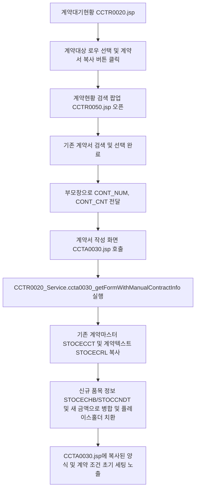

# 06_계약서복사기능

## 1. 개요 및 배경
본 기능은 NHEPRO 시스템의 **계약대기현황** 화면에서 전자계약서 작성 시, 동일하거나 유사한 내용의 기존 계약 정보를 매번 수작업으로 다시 입력해야 하는 번거로움을 개선하기 위해 도입되는 **농협정보시스템 전용 편의 기능**입니다.
계약대기현황에서 대상 품목을 선택한 후, **"계약서 복사"** 기능을 통해 이전에 작성 완료된 계약서를 검색하여 선택하면 해당 계약서의 계약조건(보증요율, 지급조건, 특약사항 등) 및 서식 템플릿(본문 내용)을 자동으로 불러와 새로운 계약서 양식에 입력합니다. 이를 통해 계약서 작성 시간을 획기적으로 단축하고 입력 오류를 방지하고자 합니다.

> [!NOTE]
> 요구사항 정의서([06.계약서 복사 기능.md](file:///c:/ST-onesIDE/workspace/NHEPRO/docs/requirements/06.%EA%B3%84%EC%95%BD%EC%84%9C%20%EB%B3%B5%EC%82%AC%20%EA%B8%B0%EB%8A%A5.md))상에는 대상 화면이 '계약대기현황(CCTR0010.jsp)'으로 표기되어 있으나, 시스템 구조 분석 결과 `CCTR0010.jsp`는 '서식관리(템플릿 관리)' 화면이며 실제 '계약대기현황' 화면은 **[CCTR0020.jsp](file:///c:/ST-onesIDE/workspace/NHEPRO/NHeProFront/src/main/webapp/WEB-INF/views/nhepro/CCTR/CCTR0020.jsp)**입니다. 따라서 실제 구현 및 본 해결 방안은 **[CCTR0020.jsp](file:///c:/ST-onesIDE/workspace/NHEPRO/NHeProFront/src/main/webapp/WEB-INF/views/nhepro/CCTR/CCTR0020.jsp)**를 기준으로 작성됩니다.

---

## 2. 현황 및 분석
- **현행 계약 작성 흐름**:
  - 현재 품의대기 또는 업체선정 완료 후 계약을 진행하기 위해 '계약대기현황([CCTR0020.jsp](file:///c:/ST-onesIDE/workspace/NHEPRO/NHeProFront/src/main/webapp/WEB-INF/views/nhepro/CCTR/CCTR0020.jsp))' 화면에서 대상을 체크하고 **"전자계약서 작성"**(`doApproval`)을 클릭하면, 해당 품목 정보와 기본 협력사 정보만 바인딩된 빈 계약서 작성 화면([CCTA0030.jsp](file:///c:/ST-onesIDE/workspace/NHEPRO/NHeProFront/src/main/webapp/WEB-INF/views/nhepro/CCTR/CCTA0030.jsp))이 열립니다.
  - 사용자는 계약서 양식을 선택한 후 계약기간, 보증금 요율, 지급방법, 첨부파일 및 계약 본문 텍스트 등 상세 조건을 매번 새롭게 입력하고 구성해야 합니다.
- **개선 필요 사항**:
  - 변경계약서 작성 시 기존 계약 정보를 바탕으로 새로운 계약(차수 증가)을 작성하는 로직(`cctr0020_doResume` 및 `CCTA0030` 연계)과 유사하게, **신규 계약 작성 시에도 기존에 완료된 특정 계약서 번호를 조회하여 헤더 정보 및 본문 HTML 텍스트를 고스란히 복제해와 초기값으로 셋팅**해 주는 공통 복사 진입점과 서비스 인터페이스가 필요합니다.

---

## 3. 해결 방안 및 실행계획



### [단계 1] 계약대기현황 화면 버튼 추가 및 제어
- **대상 화면**: [CCTR0020.jsp](file:///c:/ST-onesIDE/workspace/NHEPRO/NHeProFront/src/main/webapp/WEB-INF/views/nhepro/CCTR/CCTR0020.jsp) (계약대기현황)
- **추가 버튼**: `계약서 복사` (`doCopyContract`)
- **비즈니스 룰**:
  - 그리드에서 선택된 건이 정확히 1건(또는 동일 협력사/통화/부가세구분인 다중 품목 그룹)인지 체크합니다. (기존 `doApproval` 유효성 검사 로직 재활용)
  - 농협정보시스템 전용 기능이므로 로그인 사용자의 회사코드(`ses.companyCd = 'C00007'`) 등을 통해 제어하거나 권한 필터링을 설정합니다.
  - 버튼 클릭 시 계약을 조회하여 선택할 수 있는 계약현황 팝업([CCTR0050.jsp](file:///c:/ST-onesIDE/workspace/NHEPRO/NHeProFront/src/main/webapp/WEB-INF/views/nhepro/CCTR/CCTR0050.jsp))을 호출합니다.
    - 팝업 호출 파라미터: `popupFlag=true`, `callBackFunction=setCopyContract`

### [단계 2] 기존 계약서 검색 및 선택 팝업 구현
- **대상 화면**: [CCTR0050.jsp](file:///c:/ST-onesIDE/workspace/NHEPRO/NHeProFront/src/main/webapp/WEB-INF/views/nhepro/CCTR/CCTR0050.jsp) (계약현황)
- **화면 제어 및 팝업 모드 연동**:
  - 파라미터 `popupFlag=true`가 수신된 경우, 화면 하단에 **"선택"** 버튼을 노출하고 그리드를 단일 선택 모드로 설정합니다.
  - 조회 조건에 기본적으로 선택된 대기건의 **협력사코드(VENDOR_CD)**를 자동 바인딩하여, 타 협력사의 계약서가 오복사되는 것을 방지합니다.
  - 사용자가 완료된 계약(`PROGRESS_CD = '4300'`) 중 복사하고자 하는 계약서를 선택하고 "선택" 버튼을 클릭하거나 로우를 더블클릭하면, 해당 건의 계약번호(`CONT_NUM`)와 계약차수(`CONT_CNT`)를 부모창의 콜백 함수(`setCopyContract`)로 전달하고 창을 닫습니다.

### [단계 3] 계약서 작성 화면 (`CCTA0030`) 호출 및 파라미터 연계
- **대상 화면 및 컨트롤러**: [CCTR0020.jsp](file:///c:/ST-onesIDE/workspace/NHEPRO/NHeProFront/src/main/webapp/WEB-INF/views/nhepro/CCTR/CCTR0020.jsp) -> [CCTR0020_Controller.java](file:///c:/ST-onesIDE/workspace/NHEPRO/NHeProFront/src/main/java/com/st_ones/nhepro/CCTR/web/CCTR0020_Controller.java) (`/CCTA0030/view`)
- **매개변수 전달**:
  - 콜백 함수 `setCopyContract(data)`를 통해 전달받은 소스 계약서 정보와 현재 대기건 정보를 함께 파라미터로 조립하여 계약서 작성 팝업을 띄웁니다.
  ```javascript
  var param = {
      url: "/nhepro/CCTR/CCTA0030/view.so",
      CUR: cur,
      VAT_TYPE: vat_type,
      AMT_TYPE: amt_type,
      VENDOR_CD: vendor_cd,
      VENDOR_NM: vendor_nm,
      EXEC_NUM_SQ: exec_num_sq,
      COPY_CONT_NUM: data.CONT_NUM,    // 복사 대상 계약번호
      COPY_CONT_CNT: data.CONT_CNT,    // 복사 대상 계약차수
      copyContractFlag: "true",        // 계약서 복사 플래그
      copyFlag: "true",
      detailView: false,
      popupFlag : true
  };
  everPopup.openContractChangeInformation(param);
  ```

### [단계 4] 계약서 마스터 및 본문 텍스트 복사 백엔드 구현
- **대상 파일**: [CCTR0020_Service.java](file:///c:/ST-onesIDE/workspace/NHEPRO/NHeProFront/src/main/java/com/st_ones/nhepro/CCTR/service/CCTR0020_Service.java)
- **구현 메서드**: [ccta0030_getFormWithManualContractInfo](file:///c:/ST-onesIDE/workspace/NHEPRO/NHeProFront/src/main/java/com/st_ones/nhepro/CCTR/service/CCTR0020_Service.java#L93-L112)
- **비즈니스 로직**:
  - `copyContractFlag = "true"` 이며 `COPY_CONT_NUM`, `COPY_CONT_CNT`가 전달된 경우, 기존에 완료된 계약 정보(`STOCECCT`)를 MyBatis 쿼리 `ccta0030_getContractInformation`을 통해 조회합니다.
  - 조회된 맵 정보에서 다음 항목들을 새 계약서의 기본 파라미터 맵(`param`)에 병합(Overwrite)합니다:
    - **계약 조건**: 보증요율(`DELAY_NUME_RATE` 등), 지급조건(`PAY_TERMS`), 특약사항(`CONT_RMK`), 지연배상금률 등
    - **서식 양식 정보**: 기존 계약서에 사용된 주서식 정보(`FORM_NUM`, `CONTRACT_TEXT_NUM`, `CONTRACT_TEXT`) 및 부서식 정보(기존 `ccta0030_doSearchAdditionalForm` 활용)
  - **예외/병합 주의 사항**:
    - **품목 정보**: 품목 상세(`STOCECMT`에 들어갈 데이터) 및 계약 금액/공급가액/부가세는 기존 계약서 정보가 아닌, **현재 새로 계약을 체결하는 신규 품목 및 품의 정보(부모 그리드에서 전달된 `EXEC_NUM_SQ` 및 `STOCECHB` 대기 품목)를 기준으로 계산하여 설정**해야 합니다.
    - **계약 번호**: 새로 저장 시 복사 대상 계약번호(`COPY_CONT_NUM`)가 아닌, **신규 계약번호를 채번(`docNumService.getDocNumber`)하여 등록**해야 합니다. (이전 계약번호 `PRE_CONT_NUM` 컬럼은 필요에 따라 연계 관리)

---

## 4. 검토 사항 및 예외 처리
1. **계약서 본문 텍스트의 데이터 갱신 (플레이스홀더 재처리)**:
   - 복사하려는 기존 계약서 본문(`STOCECRL.CONTRACT_TEXT`)에는 이미 이전 계약의 금액, 협력사명, 계약일자 등이 텍스트로 치환되어 고정되어 있을 수 있습니다.
   - 단순히 텍스트만 복사할 경우 과거 데이터가 그대로 노출되는 문제가 발생합니다.
   - **해결 방안**:
     - 복사 시 본문 HTML 텍스트 내에서 동적 치환 대상 항목(예: `#CONT_AMT#`, `#CONT_DATE#`, `#ITEM_DESC#` 등)을 새 계약 건의 정보로 강제 정규식(Regex) 치환해 주는 필터 로직을 서비스 레이어에 추가합니다.
     - 혹은 원본 서식 템플릿(`STOCECCF.FORM_TEXT`)을 다시 로드하고, 복사 대상 계약의 커스텀 입력값(Clob 데이터 등)만 추출하여 재병합하는 구조를 활용합니다.
2. **협력사 불일치 방지**:
   - `CCTR0020.jsp`에서 선택한 신규 품의 대기 건의 협력사(`VENDOR_CD`)와 복사 대상 계약서의 협력사가 일치하는지 백엔드 서비스 레이어에서도 한 번 더 검증 프로세스를 수행하여 데이터 정합성을 보호합니다.
3. **첨부파일 제외 처리**:
   - 기존 계약서에 업로드되었던 첨부파일(`ATT_FILE_NUM`)은 복사하지 않고 공백으로 초기화하여, 새로운 계약에 맞는 첨부파일을 사용자가 직접 업로드하도록 유도합니다.

---

## 5. 향후 일정 및 검증 방안
- **대상 개발 파일 목록**:
  - [CCTR0020.jsp](file:///c:/ST-onesIDE/workspace/NHEPRO/NHeProFront/src/main/webapp/WEB-INF/views/nhepro/CCTR/CCTR0020.jsp): 계약서 복사 버튼 생성 및 콜백 함수 구현
  - [CCTR0050.jsp](file:///c:/ST-onesIDE/workspace/NHEPRO/NHeProFront/src/main/webapp/WEB-INF/views/nhepro/CCTR/CCTR0050.jsp): 팝업 모드(`popupFlag=true`) 제어 및 선택 처리 로직 추가
  - [CCTR0020_Controller.java](file:///c:/ST-onesIDE/workspace/NHEPRO/NHeProFront/src/main/java/com/st_ones/nhepro/CCTR/web/CCTR0020_Controller.java): 복사 정보 파라미터 수신 및 `CCTA0030/view` 전달 로직 구현
  - [CCTR0020_Service.java](file:///c:/ST-onesIDE/workspace/NHEPRO/NHeProFront/src/main/java/com/st_ones/nhepro/CCTR/service/CCTR0020_Service.java): `ccta0030_getFormWithManualContractInfo` 내 복사 정보 로드 및 신규 품의 정보 병합 로직 작성
  - [CCTR0020_Mapper.xml](file:///c:/ST-onesIDE/workspace/NHEPRO/NHeProFront/src/main/resources/mappers/com/st_ones/nhepro/CCTR/CCTR0020_Mapper.xml): 복사 대상 계약 정보 및 텍스트 데이터 조회용 MyBatis 쿼리 검증/추가

- **검증 시나리오**:
  1. **계약대기현황 접근**: `CCTR0020.jsp`에서 신규 계약 대기 중인 품목을 선택 후 "계약서 복사" 버튼이 올바르게 동작하는지 확인.
  2. **계약서 조회 및 선택**: 팝업으로 오픈된 계약현황(`CCTR0050.jsp`)에서 동일 협력사의 기존 계약서를 정상적으로 조회/선택할 수 있는지 검증.
  3. **데이터 매핑 검증**: 계약서 작성 창(`CCTA0030.jsp`)이 열렸을 때, 기존 계약서의 본문 내용 및 보증요율 등의 옵션은 유지되고, 품목 및 계약금액은 새 대기건의 정보로 정확히 갱신되었는지 확인.
  4. **저장 및 완료**: 신규 계약서 임시 저장 및 결재 요청 시 신규 계약번호로 데이터베이스(`STOCECCT`, `STOCECMT`, `STOCECRL`)에 문제없이 인서트되는지 검증.
