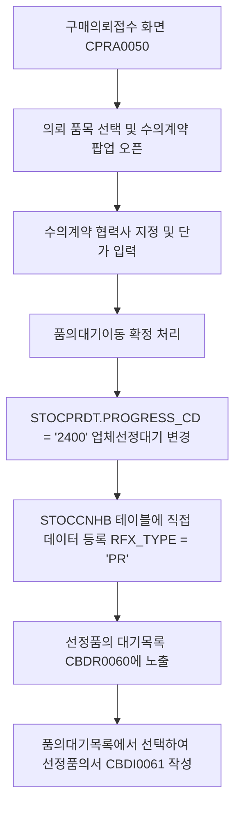

# 07_구매요청_선정품의작성

## 1. 개요 및 배경
현재 NHEPRO 시스템에서는 수의계약 건에 대하여 **수의시담(RPC)** 프로세스를 의무적으로 진행하도록 설계되어 있어, 소액이나 긴급 건 등 시담 단계를 생략하고 즉시 계약을 추진해야 하는 경우에도 불필요한 시담 절차를 거쳐야 하는 비효율이 있습니다.

이를 개선하여, 구매의뢰접수 화면에서 특정 품목에 대해 수의시담 단계를 건너뛰고 **구매요청(PR) 단계에서 곧바로 선정품의(Execution Approval)를 작성할 수 있는 "품의대기이동" 기능**을 수립합니다.

본 개선 사안은 품의대기 테이블(`STOCCNHB`)에 직접 데이터를 등록하여 기존의 선정품의 대기 현황 화면 및 대시보드 KPI와의 완벽한 데이터 정합성을 유지하도록 설계합니다.

---

## 2. 현황 및 분석
- **선정품의 대기목록(`CBDR0060`) 조회 방식**:
  - `STOCCNHB`를 매개로 하여, 입찰 낙찰 건(`BID_STATUS = '2500'`)과 견적/시담 선정 건 (`PROGRESS_CD = '2500'`)을 `UNION ALL`로 묶어 조회합니다.
  - 별도 입찰/견적이 없는 직접 수의계약 건은 기존 조인 조건(낙찰/선정 조건)을 만족할 수 없어 대기목록에 나타나지 않는 구조적 한계가 존재합니다.
- **해결 아이디어**:
  - 구매요청(PR) 접수 완료 상태에서 협력사를 직접 매핑한 후 품의대기이동을 하면, `STOCCNHB`에 `RFX_TYPE = 'PR'` 조건으로 데이터를 등록합니다.
  - 품의대기목록 조회 시 `RFX_TYPE = 'PR'`인 브랜치를 `UNION ALL`로 추가하여, 입찰/견적이 아닌 구매의뢰 테이블(`STOCPRDT`, `STOCPRHD`)과 직접 아우터 조인(Outer Join)하도록 처리합니다.

---

## 3. 해결 방안 및 실행계획



### [단계 1] 구매의뢰접수 화면 UI 구현 및 제어
- **대상 화면**: `CPRA0050.jsp` (구매요청 접수)
- **추가 버튼**: `수의계약(품의대기이동)` (`doMoveToPrSettle`)
- **비즈니스 룰**:
  - 접수완료(`PROGRESS_CD = '2200'`) 및 유찰(`PROGRESS_CD = '1300'`) 상태인 의뢰 건 중 담당 지정된 본인 건만 다중 선택하여 처리 가능.
  - 버튼 클릭 시 **수의계약 협력업체 매핑 및 계약합의 금액(단가)을 지정할 수 있는 입력 팝업**을 띄웁니다.
  - 유효한 협력사 정보(`STOCVNGL`)와 거래 가능 상태를 체크한 후 최종 승인(이동)합니다.

### [단계 2] 수의계약 정보 등록 및 품의대기 이관 (Cwd: Service)
- **대상 파일**: `CPRI0010_Service.java` / `CPRI0010_Mapper.xml`
- **비즈니스 로직**:
  1. **의뢰 상세 업데이트**:
     - 지정된 협력사코드(`VENDOR_CD`), 합의 단가(`UNIT_PRC`), 합의 금액(`PR_AMT`)을 `STOCPRDT` 테이블에 업데이트합니다.
     - 진행상태를 `'2400'` (업체선정대기)로 강제 업데이트합니다.
  2. **품의대기 등록 (`STOCCNHB` 직접 Insert)**:
     - `STOCCNHB` 테이블에 데이터를 인서트합니다.
     - **핵심 데이터 셋팅**:
       - `RFX_TYPE` = `'PR'` (구매의뢰 직송 구분자)
       - `VENDOR_CD` = 입력된 수의계약 협력사코드
       - `PR_NUM` / `PR_SQ` = 해당 구매의뢰 정보 매핑
       - `RFX_NUM` / `RFX_CNT` / `RFX_SQ` = `PR_NUM` / `1` / `PR_SQ`로 세팅하여 기존 키 구조 연동 호환성 확보.

### [단계 3] 품의대기현황(선정품의 대기목록) 쿼리 보완 (MyBatis)
- **대상 파일**: `CBDR0060_Mapper.xml`
- **조회 쿼리 개선 (`cbdr0060_doSearch`)**:
  - `RFX_TYPE = 'PR'`인 직접 수의계약 건을 조회하는 세 번째 `UNION ALL` 브랜치를 추가합니다.
  ```xml
  UNION ALL
  SELECT
        PRDT.PURCHASE_TYPE
      , PRDT.PR_NUM AS REQ_NUM         -- 품의대기목록에 의뢰번호 노출
      , 1 AS REQ_CNT
      , PRHD.SUBJECT AS SUBJECT
      , 'PR' AS RFX_TYPE               -- 구매요청(PR) 직송 구분자
      , 'SP' AS SETTLE_TYPE            -- 수의계약(Single Source)
      , '' AS CONT_TYPE1
      , '' AS CONT_TYPE2
      , '' AS CONT_TYPE3
      , 'SP' AS CONT_TYPE
      , PRDT.ITEM_CD
      , PRDT.ITEM_DESC
      , PRDT.ITEM_SPEC
      , PRDT.PR_QT AS BID_QT
      , PRDT.PR_QT AS PR_QT
      , PRDT.UNIT_CD
      , CNHB.VENDOR_CD                 -- 매핑된 수의계약 협력사
      , VNGL.VENDOR_NM
      , PRHD.CUR
      , PRDT.PR_AMT AS PR_AMT          -- 합의된 수의계약 금액
      , 0 AS TCO_YEAR_CNT
      , 0 AS TCO_AMT
      , PRDT.VAT_TYPE
      , '' AS QTA_NUM
      , '' AS VOTE_DATE
      , <include refid="common.sql.toChar"/>(CNHB.REG_DATE, 'YYYYMMDD') AS VOTE_DATE
      , <include refid="common.sql.toChar"/>(CNHB.REG_DATE, 'YYYYMMDD') AS SETTLE_DATE
      , PRDT.PR_NUM
      , PRDT.CTRL_USER_ID
      , <include refid="common.sql.dbo"/>GETUSERNAME(PRDT.GATE_CD, PRDT.CTRL_USER_ID, #{ses.langCd}) AS CTRL_USER_NM
      , '' AS END_DATE
      , 0 AS VOTE_CNT
      , PRHD.SUBJECT AS PR_SUBJECT
      , CNHB.EXEC_WT_NUM
      , CNHB.BUYER_CD
      , '0' AS TCO_FLAG
      , CNHB.PB_BUYER_CD
      , '' AS ADJ_PRC_STATUS
      , '0' AS VEND_QT_FLAG
      , PRHD.IF_TYPE
      , <include refid="common.sql.nvl"/>(PRHD.PR_TYPE, '10') AS PR_TYPE
      , PRDT.PRE_BUYER_CD
      , PRDT.PRE_CONT_NUM
      , PRDT.PRE_CONT_CNT
      , PRDT.CM_REQ_ID
    FROM STOCCNHB CNHB
    JOIN STOCPRDT PRDT
         ON (CNHB.GATE_CD  = PRDT.GATE_CD
         AND CNHB.PR_NUM   = PRDT.PR_NUM
         AND CNHB.PR_SQ    = PRDT.PR_SQ
         AND PRDT.DEL_FLAG = '0')
    JOIN STOCPRHD PRHD
         ON (PRDT.GATE_CD  = PRHD.GATE_CD
         AND PRDT.BUYER_CD = PRHD.BUYER_CD
         AND PRDT.PR_NUM   = PRHD.PR_NUM
         AND PRHD.DEL_FLAG = '0')
    LEFT JOIN STOCVNGL VNGL
         ON (CNHB.GATE_CD   = VNGL.GATE_CD
         AND CNHB.VENDOR_CD = VNGL.VENDOR_CD)
   WHERE CNHB.GATE_CD  = #{ses.gateCd}
     AND CNHB.BUYER_CD = #{ses.companyCd}
     AND CNHB.RFX_TYPE = 'PR'          -- PR 유형 필터링
     AND CNHB.DEL_FLAG = '0'
  ```

### [단계 4] 선정품의서 작성 연동 (`CBDI0061`)
- 사용자가 품의대기목록(`CBDR0060`)에서 `RFX_TYPE = 'PR'`인 대상을 선택하고 "선정품의 작성" 버튼을 클릭 시, [CBDI0061.jsp](file:///c:/ST-onesIDE/workspace/NHEPRO/NHeProFront/src/main/webapp/WEB-INF/views/nhepro/CBDI/CBDI0061.jsp) 화면으로 연동됩니다.
- 입찰/견적서 이력이 없으므로 `STOCPRDT`에 최종 저장된 협력사와 품목 단가를 기본값으로 세팅하고 즉시 수기 선정품의 작성을 진행하도록 내부 맵퍼 SQL 및 서비스 조회 로직을 07 전용 분기(`RFX_TYPE = 'PR'`) 처리합니다.

---

## 4. 검토 사항 및 예외 처리
1. **협력사 수수료 부과 조건 체크**:
   - 일반 선정품의 결재 완료 시 부과되는 모듈(`EApprovalEndExec_Service.java`)에 `RFX_TYPE = 'PR'`의 경우에 대한 검토를 진행하여 예외 오류를 방지합니다.
2. **품의대기 취소(업체선정 취소)**:
   - 품의대기목록에서 수의계약 취소 시 `STOCCNHB` 데이터를 삭제하고, `STOCPRDT`에 매핑된 정보를 원복합니다.
   - **상태 원복 분기 조건**:
     - 해당 품목의 원천 상태가 유찰건인 경우 (`STOCPRDT.FAIL_BID_NUM`이 존재하거나 `FAIL_BID_PRIVATE_FLAG = '1'`인 경우): `PROGRESS_CD`를 다시 **유찰 상태 (`'1300'`)**로 원복합니다.
     - 일반 수의계약(수의시담 생략) 건인 경우: `PROGRESS_CD`를 다시 **접수완료 상태 (`'2200'`)**로 원복합니다.
     - 두 경우 모두 매핑했던 수의계약 협력업체코드(`STOCPRDT.VENDOR_CD`) 및 관련 단가는 초기화 처리합니다.
3. **품의 반려 시 롤백 처리**:
   - 선정품의 작성 후 결재 반려되는 경우, 상태를 다시 `'2400'` (업체선정대기)로 전환하여 품의대기목록에 다시 나타나도록 처리합니다.
   - 단, 결재 전 기안자가 품의서 작성을 완전 취소/삭제하는 경우에는 위 2번(품의대기 취소)의 상태 원복 룰(유찰 건은 `'1300'`, 일반 건은 `'2200'`)에 따라 롤백을 처리합니다.
