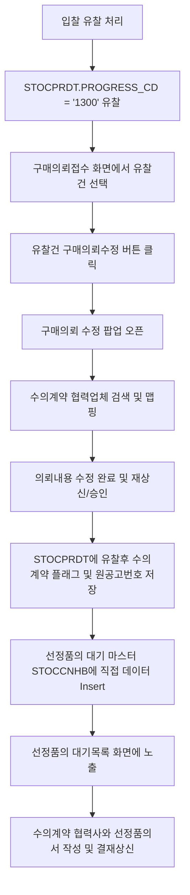

# 09_유찰후수의계약처리

## 1. 개요 및 배경
현재 NHEPRO 시스템에서는 입찰 진행 후 투찰 업체 미달 또는 낙찰자 없음 등의 사유로 **유찰(Fail Bidding)** 처리 시, 해당 구매의뢰 건의 상태가 유찰(`PROGRESS_CD = '1300'`)로 변경되고 의뢰 품목이 잠겨 추가적인 프로세스 진행이 제한됩니다.

유찰 이후 동일 건에 대해 다시 입찰 또는 견적을 진행하는 대신, 신속하고 원활한 계약 진행을 위해 **수의계약(Private Contract)으로 전환하여 처리할 수 있는 연계 기능**을 구현하고자 합니다. 

본 개선 사항에서는 구매의뢰접수 화면에서 유찰건에 대해서만 의뢰 내용을 수정하고 수의계약 대상 협력업체를 매핑하여, 별도의 입찰/견적 프로세스를 거치지 않고 즉시 선정품의 작성 단계(품의대기현황)로 연계되도록 프로세스를 수립합니다.

---

## 2. 현황 및 분석
- **데이터 흐름 및 현재 상태**:
  - 입찰 유찰 처리 시 `CBDI0020_Service.cbdi0020_doFailBidding`를 통해 입찰 공고 상태(`STOCBDHD.BID_STATUS`)는 `'1300'`(유찰)으로, 구매의뢰 상세 상태(`STOCPRDT.PROGRESS_CD`)는 `'1300'`(유찰)으로 업데이트됩니다.
  - 현재 상태에서는 유찰된 품목에 대해 신규 견적이나 입찰 작성이 제한적이며, 유찰 후 수의계약으로 진행하기 위한 명확한 구분자와 협력사 매핑 정보가 관리되지 않고 있습니다.
- **주요 개선 대상**:
  - **구매의뢰접수 (`CPRA0050.jsp`)**: 유찰건을 식별하고 수정을 요청할 수 있는 진입점 필요.
  - **구매의뢰등록/수정 (`CPRI0010.jsp`)**: 유찰된 의뢰 건에 대해 내용을 수정하고, 수의계약을 체결할 협력사를 직접 지정 및 매핑하는 화면 구성 필요.
  - **선정품의대기 (`CBDR0060_Mapper.xml`)**: 별도의 견적/입찰을 거치지 않고 수의계약 협력사가 매핑된 의뢰 건이 품의 대기 목록에 바로 노출되도록 쿼리 분기 처리 필요.

---

## 3. 해결 방안 및 실행계획

### [단계 1] 구매의뢰접수 화면 버튼 추가 및 제어
- **대상 화면**: `CPRA0050.jsp` (구매요청 접수)
- **추가 버튼**: `유찰건 구매의뢰수정` (`doModifyFailBid`)
- **비즈니스 룰**:
  - 그리드에서 선택된 로우 중 `PROGRESS_CD`가 `'1300'` (유찰)인 건에 대해서만 작동하도록 스크립트 밸리데이션 처리.
  - 담당 지정된 구매담당자가 본인 소유의 유찰건만 수정할 수 있도록 제어 (`CTRL_USER_ID == ses.userId`).
  - 버튼 클릭 시 구매의뢰수정 화면(`CPRI0010.jsp`)을 팝업으로 호출하며, 유찰 건 수정을 나타내는 파라미터(`failBidPrMod=Y`)를 함께 전달.

### [단계 2] 유찰건 구매의뢰 수정 및 수의계약 협력사 매핑
- **대상 화면**: `CPRI0010.jsp` (구매의뢰등록/수정)
- **화면 제어**:
  - `failBidPrMod=Y` 파라미터 수신 시, 유찰건 수정 모드로 동작.
  - 품목 정보 그리드 또는 상세 입력 영역에서 **'수의계약 협력사'를 선택할 수 있는 검색 팝업 링크 및 입력 필드** 제공.
  - 협력사 마스터(`STOCVNGL`) 조회를 통해 유효한 협력사코드가 매핑되도록 처리.
- **데이터베이스 저장 스키마 개선 (`STOCPRDT` 컬럼 활용 및 추가)**:
  - `FAIL_BID_PRIVATE_FLAG`: 유찰 후 수의계약 진행 여부 (`'1'`: 수의계약 진행, `'0'`: 일반)
  - `FAIL_BID_NUM`: 최초 유찰된 입찰 공고번호 (`STOCBDHD.BID_NUM` 연계)
  - `FAIL_BID_CNT`: 최초 유찰된 입찰 차수 (`STOCBDHD.BID_CNT` 연계)
  - `VENDOR_CD`: 수의계약대상 협력업체코드 저장.
- **비즈니스 로직 (`CPRI0010_Service.java` / `CPRI0010_Mapper.xml`)**:
  - 재상신 승인 완료 시점(`SIGN_STATUS = 'E'`) 또는 수정 저장 완료 시점에 `STOCPRDT` 테이블에 해당 컬럼 정보(`FAIL_BID_PRIVATE_FLAG`, `FAIL_BID_NUM`, `FAIL_BID_CNT`, `VENDOR_CD`)를 기록.
  - 유찰 후 수의계약건인 경우 기존의 일반 구매의뢰 대상테이블(`STOCPRHB`)로 인서트되는 흐름을 차단하고, 최종 승인 시 **선정품의 대기 테이블(`STOCCNHB`)로 직접 데이터를 등록**하는 로직 구현.

### [단계 3] 품의대기현황(선정품의 대기목록) 연계 및 조회 분기
- **대상 테이블**: `STOCCNHB` (선정품의대기 대상 마스터/상세)
  - `STOCCNHB` 등록 시 `RFX_TYPE` 필드값에 **`'PR'` (구매의뢰 직송 구분자)**을 사용합니다.
- **아키텍처 및 로직 공유**:
  - 유찰 후 수의계약은 [07_구매요청_선정품의작성.md](file:///c:/ST-onesIDE/workspace/NHEPRO/docs/updatefiles/07_%EA%B5%AC%EB%A7%A4%EC%9A%94%EC%B2%AD_%EC%84%A0%EC%A0%95%ED%92%88%EC%9D%98%EC%9E%91%EC%84%B1.md)의 직접 선정품의 연계 방식과 완전히 동일한 메커니즘을 사용합니다.
  - 별도의 견적/입찰을 거치지 않으므로, `STOCCNHB` 데이터 입력 및 `CBDR0060_Mapper.xml` 조회 연동 시 `RFX_TYPE = 'PR'`의 공통 조인 로직을 그대로 활용하여 처리합니다.
  - 이에 따라 중복 쿼리 개발 없이 하나의 `UNION ALL` 브랜치를 통해 수의시담 생략 건과 유찰 후 수의계약 건이 일관되게 처리됩니다.

### [단계 4] 수의계약 협력사 대상 선정품의서 작성
- **대상 화면**: `CBDI0061.jsp` (선정품의서 작성 화면)
- **작성 연동 (`CBDI0061_Service.java` / `CBDI0061_Mapper.xml`)**:
  - 사용자가 선정품의 대기목록(`CBDR0060`)에서 유찰 후 수의계약 대상을 선택하고 "선정품의 작성" 버튼을 클릭 시, `RFX_TYPE = 'PR'` 분기 처리를 통해 품의 작성 화면으로 이동합니다.
  - 상세 데이터 연동은 [07_구매요청_선정품의작성.md](file:///c:/ST-onesIDE/workspace/NHEPRO/docs/updatefiles/07_%EA%B5%AC%EB%A7%A4%EC%9A%94%EC%B2%AD_%EC%84%A0%EC%A0%95%ED%92%88%EC%9D%98%EC%9E%91%EC%84%B1.md)의 설계를 참고하여 `STOCPRDT`에 최종 저장된 협력사와 품목 금액정보가 올바르게 연계되도록 처리합니다.

---

## 4. 검토 사항 및 예외 처리
1. **협력사 정보의 유효성 검증**:
   - 수의계약 협력업체 맵핑 시 반드시 거래 가능한 거래 상태(`STOCVNGL.PROGRESS_CD = '300'` 등)의 협력사만 매핑 가능하도록 검색 팝업 단에서 필터링을 수행합니다.
2. **복수 품목 유찰 건의 처리**:
   - 하나의 구매의뢰(PR) 내에 유찰된 품목과 일반 품목이 혼재되어 있을 경우, "유찰건 구매의뢰수정" 기능은 유찰 상태(`PROGRESS_CD = '1300'`)를 가진 품목 라인에 대해서만 부분 수정을 진행하고 수의계약 연계 데이터를 생성하도록 제어해야 합니다.
3. **품의 반려 및 취소 시 상태 복구**:
   - 유찰 후 수의계약 품의서가 결재 중 반려되거나 기안자에 의해 작성 취소(삭제)될 경우, 원래 유찰 대상이었으므로 `STOCPRDT.PROGRESS_CD`를 다시 **유찰 상태 (`'1300'`)**로 원복합니다.
   - 이때 매핑했던 수의계약 협력업체코드(`VENDOR_CD`)는 초기화하여, 유찰 품목 수정을 처음부터 재진행할 수 있도록 보완합니다. (상세 상태 롤백 분기 로직은 [07_구매요청_선정품의작성.md](file:///c:/ST-onesIDE/workspace/NHEPRO/docs/updatefiles/07_%EA%B5%AC%EB%A7%A4%EC%9A%94%EC%B2%AD_%EC%84%A0%EC%A0%95%ED%92%88%EC%9D%98%EC%9E%91%EC%84%B1.md)의 원복 처리 기준을 일치시켜 구현합니다.)

---

## 5. 향후 일정 및 검증 방안
- **대상 개발 파일 목록**:
  - `NHeProFront/src/main/webapp/WEB-INF/views/nhepro/CPRA/CPRA0050.jsp`: UI 버튼 추가 및 선택 유효성 스크립트 작성
  - `NHeProFront/src/main/webapp/WEB-INF/views/nhepro/CPRI/CPRI0010.jsp`: 수의계약업체 검색 및 입력 컴포넌트 추가
  - `NHeProFront/src/main/java/com/st_ones/nhepro/CPRI/service/CPRI0010_Service.java`: 유찰 플래그 및 맵핑 정보 DB 저장 로직 및 `STOCCNHB` 이관 처리 구현
  - `NHeProFront/src/main/resources/mappers/com/st_ones/nhepro/CPRI/CPRI0010_Mapper.xml`: `STOCPRDT` 수정용 Update SQL 및 `STOCCNHB` Insert SQL 구현
  - `NHeProFront/src/main/resources/mappers/com/st_ones/nhepro/CBDR/CBDR0060_Mapper.xml`: `cbdr0060_doSearch` 내 유찰 수의계약 조회용 `UNION ALL` 쿼리 추가
  - `NHeCommon/src/main/resources/mappers/com/st_ones/eversrm/eApproval/eApprovalEnd/EXEC/EApprovalEndExec_Mapper.xml`: 결재 완료 후 수의시담 생략 및 계약대기 단계로 연계되는 후속 상태 업데이트 쿼리 검증 및 수정

- **검증 시나리오**:
  1. **유찰 상태 유도**: 특정 입찰 건에 대해 유찰(`1300`) 처리를 완료하고, 구매의뢰 상세 상태가 `'1300'`으로 업데이트되는지 확인.
  2. **의뢰 수정 및 협력사 매핑**: 구매의뢰접수 화면에서 유찰된 품목을 선택하고 `유찰건 구매의뢰수정` 버튼 클릭 시 수정 팝업이 올바르게 나타나는지 검증. 협력업체를 검색해 지정하고 저장/재상신 완료.
  3. **품의대기 이관 확인**: 수정된 의뢰 건에 대한 재상신 결재가 최종 승인된 후, `STOCCNHB` 테이블에 데이터가 정상 등록되고 `선정품의 대기목록` 화면에 해당 품목과 매핑 협력업체가 올바르게 나타나는지 검증.
  4. **선정품의서 작성**: 품의대기목록에서 해당 대상을 선택해 선정품의서 작성 창을 열었을 때, 매핑된 협력사와 품목 금액정보가 오류 없이 연동되어 신규 선정품의 결재상신이 가능한지 최종 확인.
